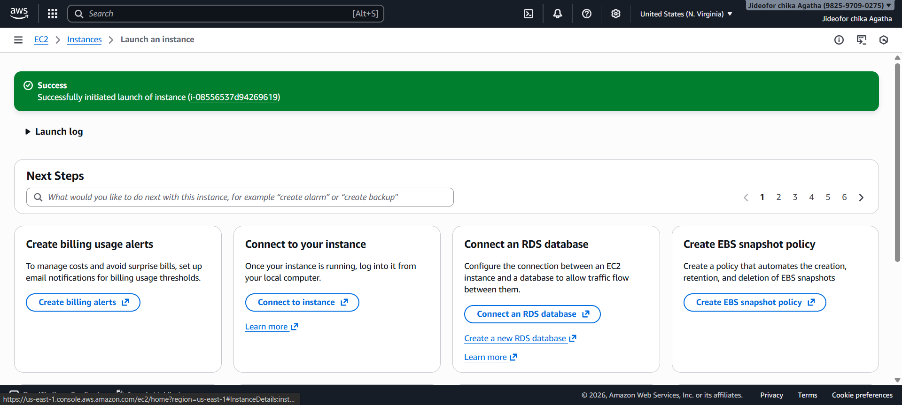
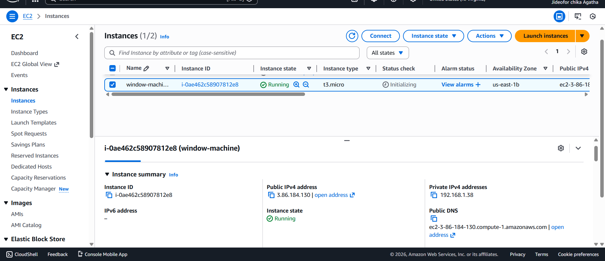
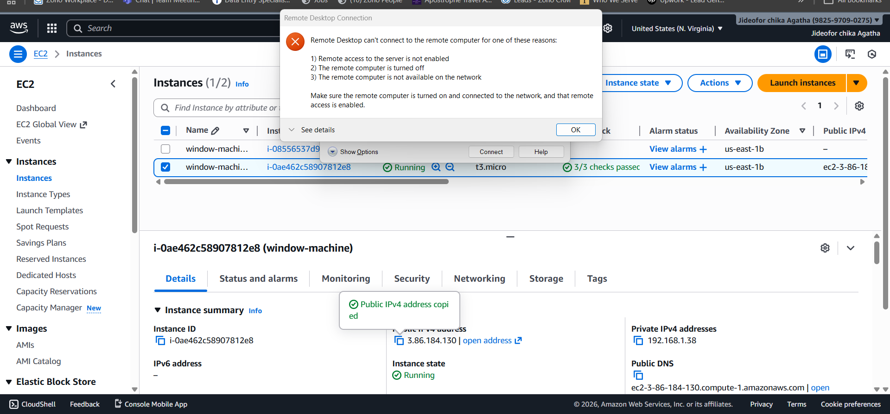
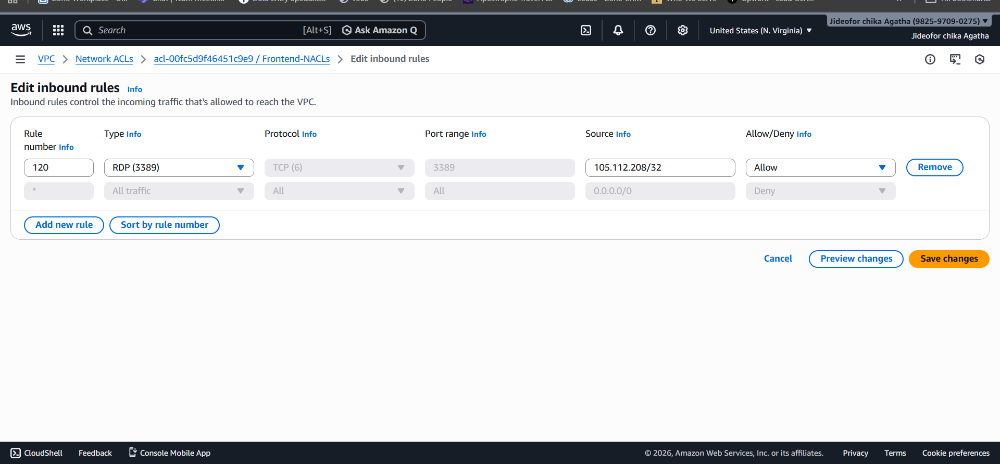
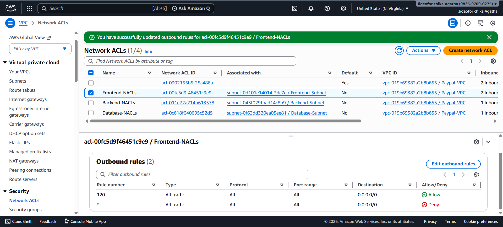
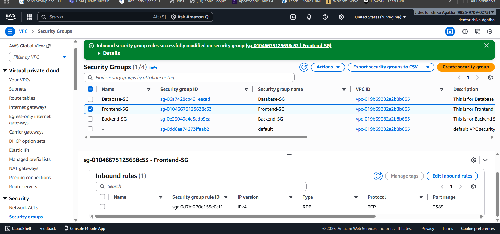
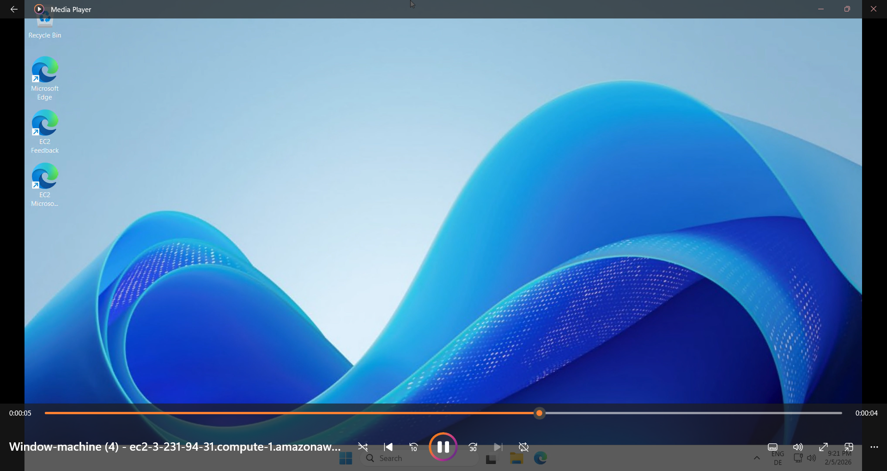

[Hosting a simple website in virtual machine (Azure 2ffc21e9947c8097acdfed175b55b167.md](https://github.com/user-attachments/files/26895993/Hosting.a.simple.website.in.virtual.machine.Azure.2ffc21e9947c8097acdfed175b55b167.md)
# Hosting a simple website in virtual machine (Azure or Aws)

## Designing Secure Azure VM Architecture using Cloud Networking : This documentation explains  how understanding  cloud networking before deployment helps in designing  secure and scalable virtual machine architecture  in Azure.

[https://www.notion.so](https://www.notion.so)

The diagram shows a Virtual Network (VNet) containing three subnets, Frontend,Backend and Database each with its own IP address range. Every subnet is associated with a Network Security Group (NSG) to control traffic flow. This setup ensures that resources in each subnet can communicate securely within the VNet while applying specific security rules for each subnet independently.

Azure VM Deployment: After the design, how to deploy the virtual machine is now clear and more understandable  on how to manually  deploy the Virtual Machine inside Azure. 

Step 1: Sign in to Azure Portal
Go to [https://portal.azure.com](https://portal.azure.com/)
Log in with your Azure account credentials.

Step 2: Create a Resource
Click “Create a resource” on the top left.
In the search box, type “Virtual Network” and select it.
Click “Create”.

Step 3: Basic Settings
Subscription: Select your Azure subscription.
Resource Group:  create a new one.
Name: Give your VNet a name (e.g., ChikajideVNet).
Region: Choose the region where your VNet will reside.(North Europe 

Step 4: Address Space
Specify the IP address range for your VNet (CIDR notation), e.g., 192.168.0.0/16.
This will define the total IP addresses available for all subnets in the VNet.

Step 5: Create Subnets
Click “Add subnet”.
Provide:
Subnet name (e.g., FrontendSubnet)
Subnet IP range (e.g., 192.188.0.0/26)
Repeat for other subnets (e.g., BackendSubnet, DatabaseSubnet).
Each subnet gets its own range of IP addresses within the VNet.

Step 6: Security
Associate Network Security Groups (NSGs) to subnets.
NSGs control traffic to and from the subnet.

Step 7: Review and Create
Review all settings.
Click “Create”.
Azure will deploy your VNet with the subnets you configured.

Step 8: Verification
Go to Virtual Networks in the portal.
Click your VNet → check Address space, Subnets, and NSG associations.

This completes the deployment of a Virtual Network (VNet) in Azure. The VNet now contains multiple subnets, each with its own IP address range and optional Network Security Group (NSG) for traffic control. This setup provides a secure and organized network environment for deploying Azure resources such as virtual machines, databases, and applications. All configurations can be monitored and modified through the Azure portal as needed.

## AWS VPC Architecture Deployment: Designing and Implementing Virtual Networks:

## **AWS VPC Architecture Illustration: 3-Subnet Deployment with Security and Logging VPC Details:**

VPC CIDR: 192.168.0.0/16
Purpose: To hosts front-end, back-end, and database subnets, securely managed, with full visibility of traffic.

Subnets inside the VPC:

**Front-end Subnet**
Example CIDR: 192.168.0.0/24
Purpose: Hosts public-facing applications (web servers)
Access: Through Internet Gateway (IGW)
Security: Protected by Network ACL (NACL) and Security Group (SG)

Back-end Subnet
Example CIDR: 192.168.1.0/24
Purpose: Hosts application servers
Access: Private; communicates with front-end subnet via routing rules
Security: Protected by NACL and SG

Database Subnet
Example CIDR: 192.168.2.0/24
Purpose: Hosts databases (RDS, etc.)
Access: Private; only accessible from back-end subnet
Security: Protected by NACL and SG

Internet Connectivity:
An Internet Gateway (IGW) is attached to the VPC to allow outbound and inbound traffic to the front-end subnet.
Routing tables are configured to direct traffic appropriately:
Front-end subnet → IGW (public access)
Back-end & Database subnets → via NAT or private routing (no direct public access)

Security Management:
NACLs: Control subnet-level inbound and outbound traffic.
Security Groups: Control instance-level inbound and outbound traffic.
Each subnet has its own set of NACL and SG rules to enforce layered security.
Monitoring and Logging:
VPC Flow Logs enabled:
Captures information about IP traffic going in and out of the VPC
Helps monitor, troubleshoot, and analyze network traffic for security and operational purposes
Data Flow Overview:
User requests → hit Front-end Subnet through IGW
Front-end communicates with Back-end Subnet for business logic
Back-end communicates with Database Subnet for data operations
All traffic monitored via VPC Flow Logs for auditing and management

# Step-by-Step Process to Create a VPC in AWS

1. Sign in to AWS Management Console
Go to AWS Console
Navigate to VPC service
2. Create a VPC
Click “Your VPCs” → “Create VPC”
Enter the details:
Name: e.g., Paypal-VPC
IPv4 CIDR block: 192.168.0.0/16
IPv6: Optional
Tenancy: Default
Click Create VPC

- Attach Internet Gateway (IGW)
Go to Internet Gateways → Create Internet Gateway
Name it: MyVPC-IGW
Click Actions → Attach to VPC and select MyVPC

- Create Subnets
Create 3 subnets for Front-end, Back-end, and Database:
Front-end Subnet:
Go to Subnets → Create Subnet
Name: FrontEndSubnet
VPC: Select Paypal-VPC
Availability Zone: Choose one
CIDR block: 192.168.0.0/24
- Back-end Subnet:
Name: BackEndSubnet
CIDR block: 192.168.1.0/24
- Database Subnet:
Name: DatabaseSubnet
CIDR block: 192.168.2.0/24
- Enable Your DNS hostnames for your automatic public IP Address.

- Configure Route Tables
Go to Route Tables → Create Route Table
Name it: PublicRouteTable
Associate with MyVPC
Add route to IGW:
Destination: 0.0.0.0/0
Target: Select your IGW
Associate this route table with Front-end Subnet
For Back-end & Database subnets, you can use a private route table (no direct IGW)

Clear Overview of  my VPC dashboard.

- Enable VPC Flow Logs
Go to VPC → Your VPCs → Flow Logs → Create Flow Log
Select:
Resource type: VPC
Destination: CloudWatch Logs or S3 Buckets preferably 
Click Create Flow Log Accepted, Rejected or  All
This will log all inbound and outbound traffic for monitoring

Launch EC2 Instance: Window Machine using window Microsoft (AMI)

Select the gereation instance you need and calculate with EC2 calculator.

Using t3.micro ,Add SSH key pair for connecting instance which will be downloaded to your PC.

Network Setting:

Go to editting,select frontend-subnet,Enable to put IOPS address to the VM.

Click and Launch 

Successfully Launched Window-machine.

- Configure Network ACLs (NACLs)
Go to Network ACLs → Create Network ACL
Associate with MyVPC
Configure Inbound & Outbound rules per subnet:
Example: Front-end NACL allows HTTP/HTTPS, blocks unknown traffic
Back-end and Database NACLs allow only specific subnets

 

 Successfully Launched and connected my PC using RDP protocol with my VPC Public IP Address.
